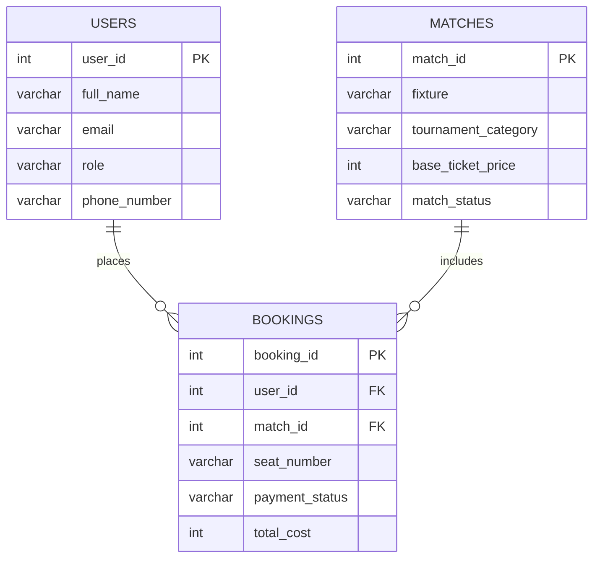

# B7A3-FTBS

Football Ticket Booking System (Database)

## Overview
This repository contains the SQL schema and sample seed data for a **Football Ticket Booking System**. It defines 3 core entities:
- `Users`
- `Matches`
- `Bookings`

The SQL script is in:
- `QUERY.sql`

---

## Database Setup Query
The script starts by creating the database:

```sql
CREATE DATABASE football_ticket_booking_system;
```

---

## Table Definition Queries (DDL)

### 1) Users Table
```sql
CREATE TABLE Users (
  user_id serial PRIMARY KEY,
  full_name varchar(100) NOT NULL,
  email varchar(100) NOT NULL UNIQUE,
  role varchar(25) CHECK ( role IN ('Ticket Manager', 'Football Fan')),
  phone_number varchar(20)
);
```

**Purpose:** stores user profile and role information.  
**Key constraints:**
- `user_id` is primary key
- `email` is unique
- `role` is restricted to `Ticket Manager` or `Football Fan`

### 2) Matches Table
```sql
CREATE TABLE Matches (
  match_id serial PRIMARY KEY,
  fixture varchar(100) NOT NULL,
  tournament_category varchar(50) NOT NULL,
  base_ticket_price int NOT NULL,
  match_status varchar(25)
    CHECK (match_status IN ('Available', 'Selling Fast', 'Sold Out', 'Postponed'))
);
```

**Purpose:** stores football match and ticket status details.  
**Key constraints:**
- `match_id` is primary key
- `match_status` is constrained to allowed status values

### 3) Bookings Table
```sql
CREATE TABLE Bookings (
  booking_id serial PRIMARY KEY,
  user_id int NOT NULL REFERENCES Users(user_id),
  match_id int NOT NULL REFERENCES Matches(match_id),
  seat_number varchar(20),
  payment_status varchar(20) 
    CHECK (payment_status IN ('Pending', 'Confirmed', 'Cancelled', 'Refunded')),
  total_cost int NOT NULL
);
```

**Purpose:** records ticket booking transactions.  
**Key constraints:**
- `booking_id` is primary key
- `user_id` is a foreign key to `Users(user_id)`
- `match_id` is a foreign key to `Matches(match_id)`
- `payment_status` is constrained to valid payment states

---

## Drop Table Queries
Before creating tables, existing tables are dropped to avoid conflicts:

```sql
DROP TABLE IF EXISTS Bookings;
DROP TABLE IF EXISTS Matches;
DROP TABLE IF EXISTS Users;
```

---

## Seed Data Insert Queries (DML)

### Insert into `Users`
Sample users include both football fans and a ticket manager.

### Insert into `Matches`
Sample matches include different tournament categories and statuses.

### Insert into `Bookings`
Sample booking records connect users to matches with payment status and total cost.

---

## Entity Relationship Diagram (ERD)



### Relationship Summary
- **One User** can create **many Bookings**.
- **One Match** can appear in **many Bookings**.
- `Bookings` is the bridge table between `Users` and `Matches`.

---

## Notes
- The schema currently uses `int` for pricing fields (`base_ticket_price`, `total_cost`). For real-world money handling, `numeric(10,2)` is often preferred.
- Seed values in the SQL currently include decimal-like values for some integer columns; adjust data types or values for strict consistency.
